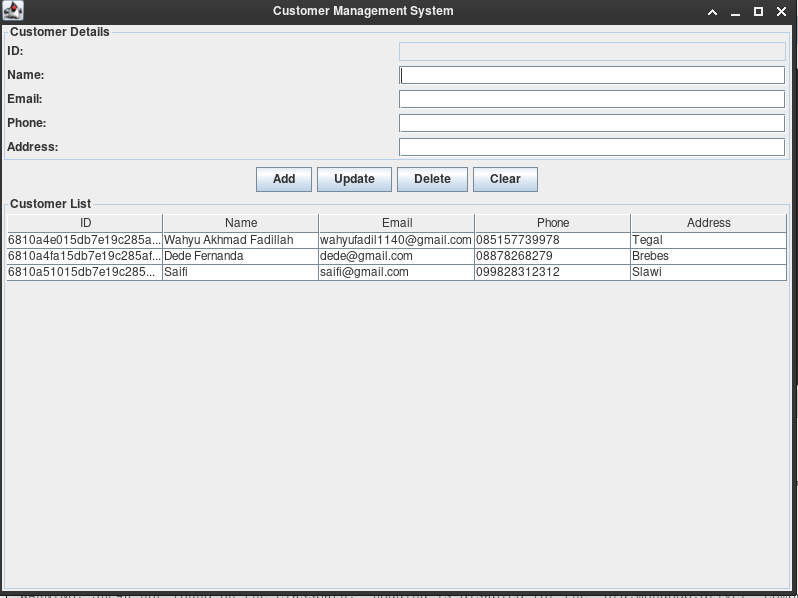
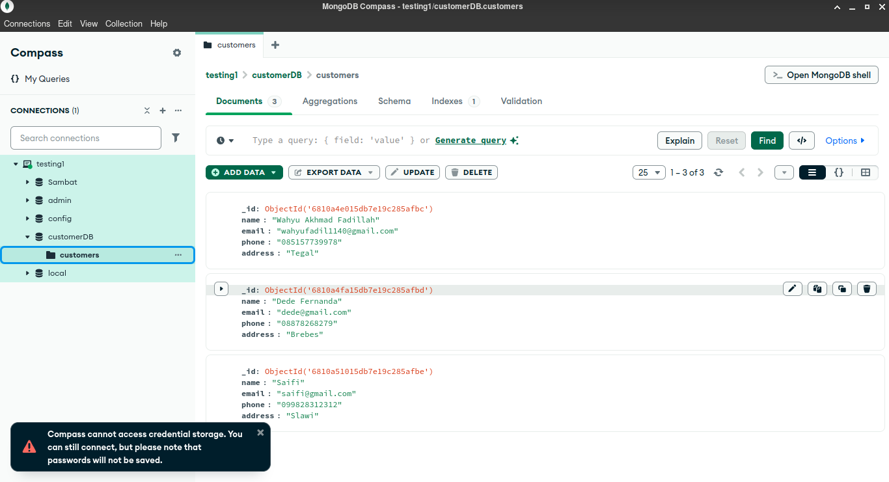

### Simpel Java Desktop Customer data management with MongoDB
A lightweight Java desktop application to manage customer data using MongoDB as the database backend. This app demonstrates basic CRUD operations (Create, Read, Update, Delete) with a simple GUI.

Screenshots

Application Interface:

Data View in MongoDB Compass:

Tech Stack
    - Java (Swing)
    - MongoDB
    - MongoDB Java Driver

This project is licensed under the [MIT License](./LICENSE).
